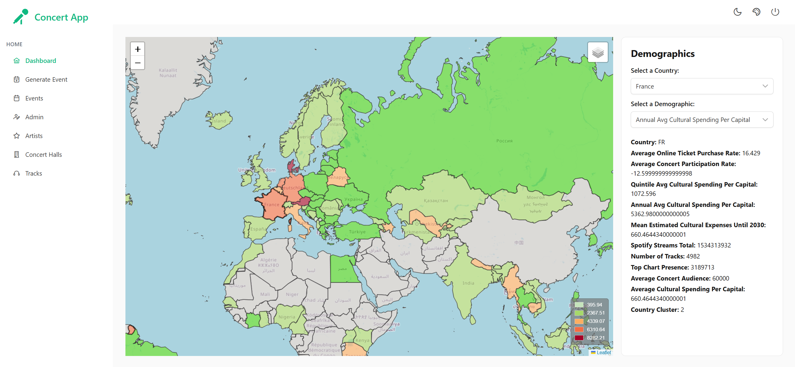

# 🎨 PrimeVue Demo - Frontend Vue.js

Ce projet correspond à la partie frontend utilisant **Vue 3**, **PrimeVue** et **TailwindCSS**, construit avec **Vite** pour un développement rapide et moderne.

---

## ⚙️ Stack utilisée

- Vue 3  
- PrimeVue 4.3.3  
- TailwindCSS 3.x  
- Vite 4.x  
- Vue Router 4.5  
- Axios  
- PrimeIcons  
- TailwindCSS PrimeUI Plugin  

---

## 🚀 Lancer le projet

### 1. Cloner le dépôt

`git clone https://github.com/votre-utilisateur/TD_DDD.git`  
`cd TD_DDD/frontend`

### 2. Installer les dépendances

`npm install`

### 3. Lancer le serveur de développement

`npm run dev`

- Le projet sera disponible à : http://localhost:5173

---

## 📊 Dashboard interactive

La dashboard vous permet :

- de **sélectionner un pays** via un menu déroulant ou directement sur la carte en cliquant 
- de **choisir un indicateur démographique** à visualiser (ex : dépenses culturelles, audience concert, streams Spotify…)  
- de voir la **carte se colorer dynamiquement** selon la valeur sélectionnée (du vert au rouge)  
- d’afficher les **détails complets** du pays sélectionné dans un panneau latéral

### 🖼️ Aperçu visuel

---

## 📖 Documentation externe

- [Vue 3 Documentation](https://vuejs.org/)  
- [PrimeVue Documentation](https://www.primefaces.org/primevue/)  
- [TailwindCSS Documentation](https://tailwindcss.com/)  
- [Vite Documentation](https://vitejs.dev/)
